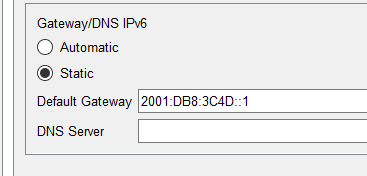
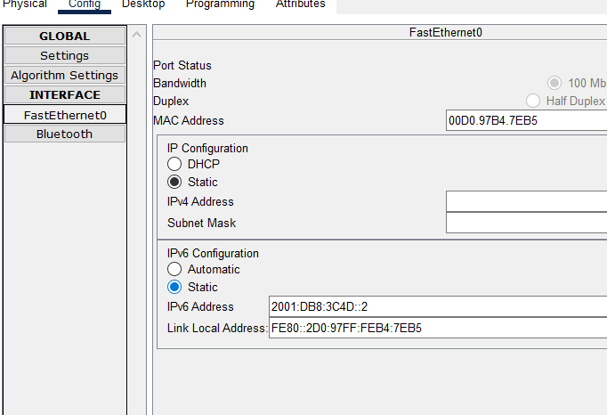
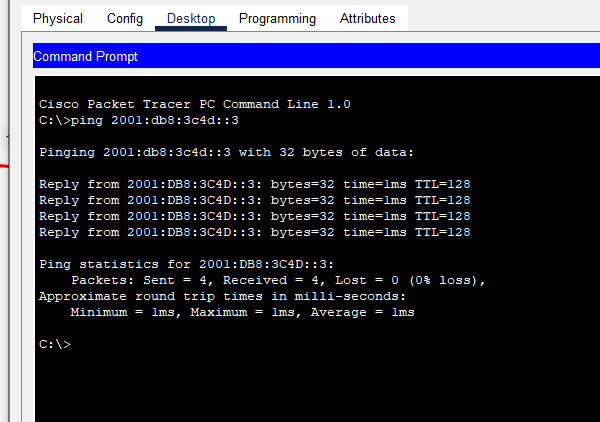

# IPv6 Basic Configuration Guide

A comprehensive documentation for IPv6 network setup and configuration with 2 PCs, 1 switch, and 1 router.

## 📋 Table of Contents

- [Overview](#overview)
- [Network Topology](#network-topology)
- [Prerequisites](#prerequisites)
- [Configuration Steps](#configuration-steps)
- [Verification](#verification)
- [Troubleshooting](#troubleshooting)

## 🌐 Overview

This repository contains step-by-step documentation for configuring a basic IPv6 network infrastructure. The setup includes:

- 2 Host PCs
- 1 Network Switch
- 1 Router
- IPv6 addressing and routing configuration

## 🗺️ Network Topology


The network topology demonstrates a simple IPv6 environment where two hosts are connected through a switch to a router, enabling IPv6 communication.

## 📦 Prerequisites

- Cisco Packet Tracer (or physical network equipment)
- Basic understanding of networking concepts
- Familiarity with IPv6 addressing format

## ⚙️ Configuration Steps

### Router Configuration


```cisco
Router> enable
Router# configure terminal
Router(config)# interface GigabitEthernet0/0
Router(config-if)# ipv6 address 2001:db8:acad:1::1/64
Router(config-if)# ipv6 enable
Router(config-if)# no shutdown
Router(config-if)# exit
```

### IPv6 Default Gateway Setup



Configure the default gateway on each host to enable communication beyond the local network.

### IPv6 Address Assignment



Assign IPv6 addresses to each host:
- Host 1: `2001:db8:acad:1::2/64`
- Host 2: `2001:db8:acad:1::3/64`

## ✅ Verification



Verify your configuration using these commands:

```bash
# On hosts (Windows/Linux)
ping 2001:db8:acad:1::1
ipconfig /all  # Windows
ifconfig       # Linux

# On router
Router# show ipv6 interface brief
Router# show ipv6 route
```

## 🔧 Troubleshooting

Common issues and solutions:

1. **Cannot ping between hosts**
   - Verify IPv6 addresses are correctly configured
   - Check if interfaces are up (`no shutdown`)
   - Ensure all devices are on the same subnet

2. **No IPv6 connectivity**
   - Confirm IPv6 is enabled on router interfaces
   - Check default gateway configuration on hosts
   - Verify cable connections in topology

3. **Router not forwarding packets**
   - Enable IPv6 routing: `ipv6 unicast-routing`
   - Check interface status: `show ipv6 interface brief`

## 📚 Additional Resources

- [IPv6 Address Format](https://www.ietf.org/rfc/rfc4291.txt)
- [Cisco IPv6 Configuration Guide](https://www.cisco.com/c/en/us/td/docs/ios-xml/ios/ipv6/configuration/xe-16/ipv6-xe-16-book.html)

## 📝 Notes

- This is a personal documentation for learning purposes
- Screenshots are stored in `/assets` directory but referenced via direct URLs
- Configuration may vary depending on your network equipment

## 🤝 Contributing

This is a personal learning repository, but feel free to fork and adapt for your own use.

## 📄 License

This documentation is free to use for educational purposes.

---

**Last Updated:** November 2025
